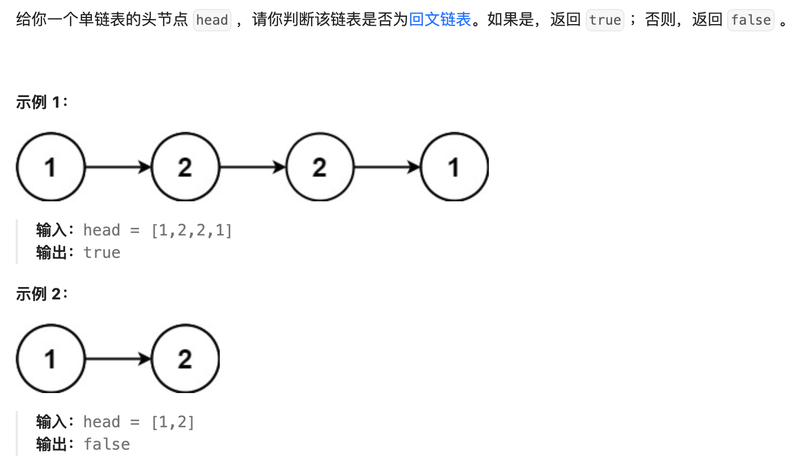
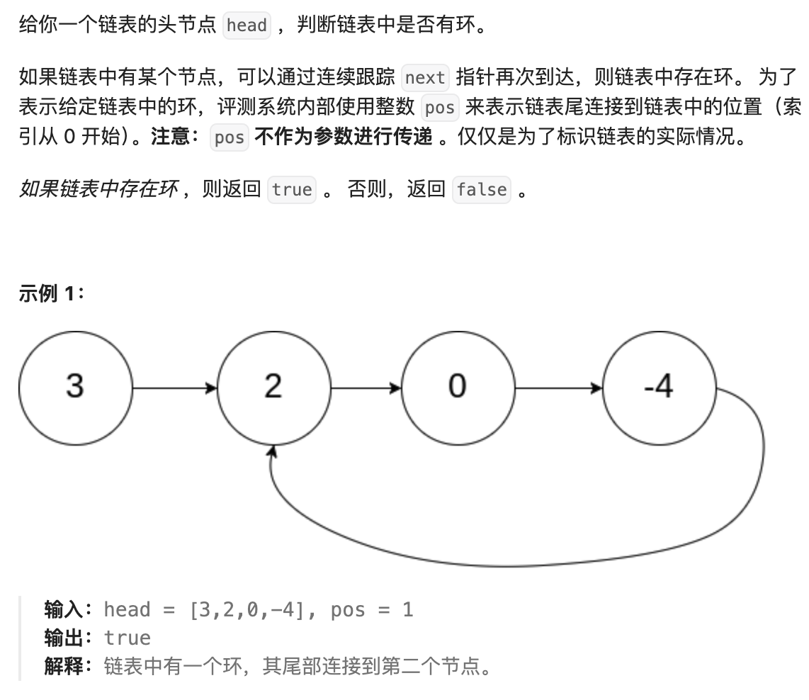

# LeetCodePass

## 1. 两数之和

### 1.1 题目描述

> 给定一个整数数组 `nums` 和一个整数目标值 `target`，请你在该数组中找出**和为目标值** *`target`* 的那**两个**整数，并返回它们的数组下标。
>
> 你可以假设每种输入只会对应一个答案。但是，数组中同一个元素在答案里不能重复出现。
>
> 你可以按任意顺序返回答案。
>
> **示例 1：**
>
> ```
> 输入：nums = [2,7,11,15], target = 9
> 输出：[0,1]
> 解释：因为 nums[0] + nums[1] == 9 ，返回 [0, 1] 。
> ```
>
> **示例 2：**
>
> ```
> 输入：nums = [3,2,4], target = 6
> 输出：[1,2]
> ```
>
> **示例 3：**
>
> ```
> 输入：nums = [3,3], target = 6
> 输出：[0,1]
> ```


### 1.2 题目解答

本题的详细思路参考LeetCode题解[直观的 Python 题解：思路推导&代码注释](https://leetcode.cn/problems/two-sum/solutions/1463966/jian-dan-python-by-chanemo-muld/?envType=study-plan-v2&envId=top-100-liked)

> **核心观念：编程实际上是用计算机实现人工能干的事情。**
> 因此解题可以遵循 “**人工推导——从个体到群体——从特殊到普遍**” 的思路，即从个例推出通解。

为了让自己带入思考，故选择示例2进行人工推导的思路展开：

如果让人来完成这道题，最简单的方式就是逐一排查（遍历），对于数组`[3，2，4]`和目标值`6`：

```
（1）取3，此时另一个加数应该为6-3=3，下一步则在剩下的元素中寻找是否有3，有则返回两个3的下标，没有则继续取下一个元素；
（2）取2，此时另一个加数应该为6-2=4，下一步则在剩下的元素中寻找是否有4，有则返回2和4的下标，即[1,2]
（3）取4，此时另一个加数应该为6-4=2，下一步则在剩下的元素中寻找是否有2，有则返回4和2的下标，即[2,1]
```

因为题目强调了只存在一个答案，所以在解题时只需要存在一个解即可返回结果；同时根据上述过程可以看到存在重复的情况，即2和4的组合一样，只不过换了位置。因此，遍历当前元素的时候就不用再从该元素之前的元素中找答案了。

使用人工推导的思维打开解题思路后，剩下的过程即将上述解题步骤中的自然语言转换为代码：

```python
class Solution(object):
  def TwoSum(self,nums,target):
    '''
    type nums: List[int]
    type target: int
    rtype List[int]
    '''
    #按照解题思路，首先我们要遍历整个列表
    for i in range(len(nums)):
      #当取nums[i]的时候，另一个加数应该为：
      res = target - nums[i]
      #下一步即在剩下来的元素中找是否有另一个加数
      if res in nums[i+1:]:
        #如果存在即可返回两个加数的下标，结束程序
        #需要强调的是，为了避免重复，另一个加数总会在当前取的加数之后的元素中去找，因此对nums进行了切片，此时的res是从nums中的第i+1个元素开始匹配。也就是说，原始列表的第i+1个元素在切片后的列表nums[i+1:]中为第0个元素
        #因此在获取res在nums[i+1:]中国的索引后还需要再加上i+1，才是其在原始列表中的下标
        return[i,nums[i+1:].index(res)+i+1]
      
#用户自行输入数组和目标值用于测试
input_nums = input("请输入整数数组：")
input_target = input("请输入整数目标值：")

#需要将输入的字符串转换为整数列表，输入的目标值转换为整数目标值
test_nums = [int(num.strip())for num in input_nums.split(',')]
test_target = int(input_target)

#创建test测试对象并调用TwoSum方法
test = Solution()
result = test.TwoSum(test_nums,test_target)
print(result)
```


### 1.3 基础知识汇总

- [Python中range函数的用法](https://www.runoob.com/python/python-func-range.html)
- [Python中List index()方法](https://www.runoob.com/python/att-list-index.html)
- [Python中for循环语句](https://www.runoob.com/python/python-for-loop.html)
- [Python中split()方法](https://www.runoob.com/python/att-string-split.html)
- [Python中strip()方法](https://www.runoob.com/python/att-string-strip.html)


## 2 移动零

### 2.1 题目描述

> 给定一个数组 `nums`，编写一个函数将所有 `0` 移动到数组的末尾，同时保持非零元素的相对顺序。
>
> **请注意** ，必须在不复制数组的情况下原地对数组进行操作。
>
> **示例 1:**
>
> ```
> 输入: nums = [0,1,0,3,12]
> 输出: [1,3,12,0,0]
> ```
>
> **示例 2:**
>
> ```
> 输入: nums = [0]
> 输出: [0]
> ```


### 2.2 题目解答

#### 2.2.1 引入新数组

该方法的基本思路为：遍历输入的数组，记住非零元素的下标，将非零元素按顺序放置在新数组中，最后将剩下的零元素加入新数组的末尾。

```python
class Solution(Object):
  def moveZeroes(self,nums):
    #定义一个空的新数组
    result = []
    zero_count = 0
    #遍历输入的数组，找出非零元素，按顺序存入新数组
    for i in range(len(nums)):
      if nums[i] !=0:
        result.append(nums[i])
      else:
        zero_count += 1
    
    result.expend([0]*zero_count)
    return result
  
test = Solution()
nums = input("请输入数组：")
test_nums = [int(nums.strip()) for num in nums.slip(',')]
results = test.moveZeroes(test_nums)
print(result)
```


#### 2.2.2 双指针——两次遍历

该方法的详细思路参考LeetCode题解：[动画演示283.移动零](https://leetcode.cn/problems/move-zeroes/solutions/90229/dong-hua-yan-shi-283yi-dong-ling-by-wang_ni_ma/?envType=study-plan-v2&envId=top-100-liked)

> 核心观点是：该方式创建了两个指针 `i` 和 `j`,第一次遍历的时候，由指针`j`记录输入数组中的非零元素。即遍历的时候每遇到一个非零元素就将其往数组左边挪，第一次遍历结束的时候，指针`j`元素刚好指向的是最后一个非零元素的下一个元素。
>
> 这样在第二次遍历的时候，只需要将从`j`开始到数组结束后的元素均置为0即可。

```python
class Solution(Object):
  def moveZeroes(self,nums):
    j = 0
    for i in range(len(nums)):
      if nums[i]:
        nums[j] = nums[i]
        j += 1
    for i in range(j,len(nums)):
      nums[i] = 0
      
    return nums

test = Solution()
nums = input("请输入数组：")
test_nums = eval(nums)
results = test.moveZeroes(test_nums)
print(resultes)
```


#### 2.2.3双指针——一次遍历

该方法的详细思路参考LeetCode题解：[动画演示283.移动零](https://leetcode.cn/problems/move-zeroes/solutions/90229/dong-hua-yan-shi-283yi-dong-ling-by-wang_ni_ma/?envType=study-plan-v2&envId=top-100-liked)

> 核心观点是：参考快速排序的思想，以`0`作为中间点，不等于`0`的元素均放置在`0`的左边，等于`0`的元素均放置在其右边。具体的实现思路就是利用指针 `i` 和 指针`j`，遍历输入数组，只要`nums[i]`!=0，就将其与`nums[j]`交换位置。

```python
class Solution(object):
  def moveZeroes(self,nums):
    j = 0
    for i in range(len(nums)):
      if nums[i]:
        temp = nums[i]
        nums[i] = nums[j]
        nums[j] = temp
        j += 1
    return nums
  
test = Solution()
nums = input("请输入数组：")
test_nums = eval(nums)
result = test.moveZeroes3(test_nums)
print(result)
```


### 2.3 基础知识汇总

- [python extend()与append()的区别](https://blog.csdn.net/weixin_38145317/article/details/89485983)
- [Python eval() 函数](https://www.runoob.com/python/python-func-eval.html)


## 3 相交链表

### 3.1 题目描述


### 3.2 题目解答

本题解题思路参考LeetCode题解：[【相交链表】五种解法～](https://leetcode.cn/problems/intersection-of-two-linked-lists/solutions/887414/xiang-jiao-lian-biao-wu-chong-jie-fa-by-j73p5/?envType=study-plan-v2&envId=top-100-liked)

想要解答该题，首先需要了解相交链表的概念。这里给出查阅的两个解释：

**解释一**：[图解LeetCode_160.相交链表](https://cloud.tencent.com/developer/article/2286581)


**解释二：**来自chatGPT4.0

> 相交链表是指两个单链表在某个节点处“相交”，并且从该节点**之后的部分完全共享**。也就是说，它们从这个相交点开始拥有相同的节点。
>
> #### 如何判断两个链表是否相交？
>
> 1. **计算长度**：我们可以先分别遍历两个链表，计算它们的长度。
> 2. **对齐指针**：因为两个链表相交后的部分是相同的，所以我们可以将较长链表的指针向前移动，使两个链表的指针位于相同的剩余长度上。
> 3. **同步遍历**：然后我们同时遍历两个链表，逐个比较它们的节点。如果两个指针指向同一个节点，则表示找到相交节点。如果遍历结束都没有发现相交点，则表示它们没有相交。

了解了相交链表的概念后，再来观察此题，题目已经说明了给出的为两个单链表，所以要么这两个链表相交（及相交节点后的部分完全相同），要么为平行链表，不可能为解释一中的情况2。所以，只需要确认两个单链表是否有相同的节点值即可。

```python
class Solution(object):
  def getIntersectionNode(self,headA,headB):
    s = set()
    p,q = headA,headB
    #将链表A存入
    while p:
      s.add(p)
      p = p.next
      
    while q:
      if q in s:
        return q
      q = q.next
    return None
```


## 4. 反转链表

### 4.1 题目描述


### 4.2 题目解答

本题的解题思路参考[《代码随想录》：帮你拿下反转链表](https://www.bilibili.com/video/BV1nB4y1i7eL/?vd_source=63ae45ff293024cc1925b41a2202a3a6)

该视频提供了两种解题思路，个人认为双指针的逻辑相较于递归解法更加清晰，也更易懂。

#### 4.2.1 双指针

所谓双指针，顾名思义就是引入了两个指针：cur指针初始化为head指针，pre指针为空指针。

为了便于理解，我们以示例1的图为参考，此时cur指针相当于1，正向情况下它指向它的后一个节点2。而为了使链表反转，需要让1指向他的前一个节点，即定义的pre指针，翻译成代码，也就是cur.next = pre。但是需要注意的是，在改变链表方向前，不能丢失后面的节点，所以应该先让一个临时指针存下后面的节点，再进行反转，即tmp = cur.next。

这样就完成了一个节点的反转，接下来只需要把pre指针和cur指针向后移动，重复上述步骤即可。不过，这里还需要注意，需要先移动pre指针，再移动cur指针。否则，pre指针无法找到cur指针的原始位置。当pre指针移动到尾节点时，链表才完成了整体的反转。此时，cur指针脱离了链表，成为了空指针。

```python
def reverseList(self, head):
  #初始化指针
  cur = head
  pre = None
  
  #当cur指针非空时，一直进行反转操作
  while cur:
    tmp = cur.next #先用tmp指针保存后面的节点
    cur.next = pre #再反转链表方向
    # 反转完成后，先移动pre指针,再移动cur指针
    pre = cur
    cur = tmp
  
  return pre
```


#### 4.2.2 递归

实际上，递归的方式完全是按照双指针的逻辑进行改写的，只不过把循环变成了迭代

```python
def reverseList(self, head):
  #把双指针的思路转换为一个递归函数
  def reverse(cur, pre)：
  	if cur == None:
      return pre
    tmp = cur.next
    cur.next = pre
    
    #把移动的步骤转换为递归
    return reverse(tmp,cur)
  
  #主体函数只需要调用递归函数即可
  return reverse(head, None)
```


## 5. 回文链表

### 5.1 题目描述




### 5.2 题目解答

本题的解题思路参考Leetcode题解[快慢指针+链表逆序](https://leetcode.cn/problems/palindrome-linked-list/solutions/457256/kuai-man-zhi-zhen-lian-biao-ni-xu-by-airesearcherj/?envType=study-plan-v2&envId=top-100-liked)

实际上拿到这道题，首先要理解什么是回文链表。所谓“回文”说的通俗点就是以中间点为轴，左右两边对称（或者说呈镜像）。那转换为计算机判断思想，也就是找到中间几点后，分为左右两个链表，把右边的链表反转，两边同时从头节点开始移动。若每个节点的值都相等，说明是回文链表。

其实对于后面的链表反转已经不陌生了，刚好上一提反转链表就是用来解决这个问题的。那怎么去解决寻找中间结点的问题，题解介绍了一种快慢指针的方式。那利用该方式能找到中间结点的[原理](https://blog.csdn.net/qq_40663810/article/details/79382283)是：

> 定义了一个快指针fast和一个慢指针slow，快指针一次移动两个结点，慢指针一次移动一个结点。
>
> 当fast到达链表尾部结点的时候，慢指针也就移动到了链表的中间结点（同化成一个路程问题，同一段路程，A的速度是B的两倍，他们同时出发，当A走完全程时，B也就刚好走过一半）
>
> 如果结点个数是偶数个的话，slow指向中间两个元素的右边那个元素。

```python
def isPalindrome(self,head):
  #考虑空链表的情况（空链表也可视为回文链表）
  if not head:
    return True
  
  #引入快慢指针，找到回文链表的中间结点
  fast = head
  slow = head
  ## 保证快慢指针还可以往后移动，实际上fast.next就是slow.next，fast.next.next才是真正的fast.next
  while fast.next and fast.next.next：
  	fast = fast.next.next
    slow = slow.next
    
  #此时，slow的位置即为中间结点，将中间结点右侧的链表进行反转
 	pre = None
  cur = slow.next
    
  while cur:
    tmp = cur.next
    cur.next = pre
    pre = cur
    cur = tmp
      
   #反转完成后，pre作为右链表的头节点，此时要判断整个链表是否为回文链表只需要判断左右链表对应的结点值是否相等
  while pre:
    if pre.val != head.val:
      return False
    pre = pre.next
    head = head.next
    
    return True
```


## 6. 环形链表

### 6.1 题目描述



### 6.2 题目解答

本题的解题思路参考LeetCode题解[力扣官方题解](https://leetcode.cn/problems/linked-list-cycle/solutions/440042/huan-xing-lian-biao-by-leetcode-solution/?envType=study-plan-v2&envId=top-100-liked)

#### 6.2.1 哈希表

> 最容易想到的思路就是遍历所有节点，每次遍历到一个节点的时候，判断该节点此前是否被访问过。
>
> 具体地，我们可以使用哈希表来存储所有已经访问过的节点。每次我们到达一个节点，如果该节点已经存在于哈希表中，则说明该链表是环形链表，否则就将该节点加入哈希表中。重复这一过程，直到我们遍历完整个链表即可。

实际上我在理解这个方法的时候，不太明白哈希表到底存的是什么。我一直以为存的是节点的数值，所以我以为这种方式无法判断，因为会出现相同值但是不是环形链表（如回文链表）的情况。但是询问了GPT后才明白，哈希表存储的是每个节点的指针（内存地址），而不是节点的数据域。因为节点的数据域可能相同，但内存地址一定是独一无二的。所以，再看该解法，实际上就是哈希表存了已经遍历过的节点地址，如果遍历到某节点的是否发现该节点地址已经存在于哈希表，说明这个节点在之前就已经遍历过了，那一定能说明存在环。

```python
class Solution(Object):
  def hasCycle(self, head):
    seen = set()
    while head:
      if head in seen
      	return True
      seen.add(head)
      head = head.next
    return False
```


#### 6.2.2 快慢指针

该方法实际上对于一开始接触这种题型的我是打死都想不出来的。。。

> 本方法需要对"Floyd判圈算法"（又称龟兔赛跑算法）有所了解。
>
> 假想乌龟和兔子在链表上移动，兔子跑得快（一次移动两个节点），乌龟跑的慢（一次移动一个节点）。
>
> 当乌龟和兔子在链表上的同一个节点开始移动时，如果该链表中没有环，那么兔子将一直处于乌龟的前方；如果链表中存在环，那么兔子会先于乌龟进入环，并且一直在环内移动。等到乌龟进入环时，由于兔子的速度快，，它一定会在某个时刻与乌龟相遇。
>
> 兔子会不会跳过乌龟，从来不会和乌龟相遇呢？这是不可能的，如果有环的话，那么兔子和乌龟都进入环中。这时用“相对速度”思考，乌龟不动，兔子相对于乌龟每次只走一步，这样就可以看出兔子一定会和乌龟相遇了。

```python
class Solution:
  def hasCycle(self, head):
    fast = slow = head
    # 循环的条件是要保证快慢指针还能移动(快针移两步，慢针移一步)。
    while fast and fast.next:
      fast = fast.next.next
      slow = slow.next
      if slow == fast:
        return True
    
    return False
```

对于这种解法，我唯一不太明白的就是进入while循环的条件。这个条件是为了保障快慢指针都能向前移动，但是对于快指针，我想的是，要保证`fast.next.next`存在，也就是说我想的循环条件是`fast.next` 和`fast.next.next`均非空。

当我们在循环中检查`while fast and fast.next`，实际上确保了两件事：

1. fast存在：意味着链表至少有一个节点，快指针可以站在这个节点上。
2. Fast.next存在，意味着至少还有一个额外的节点，快指针可以安全地向前移动一步。

其实这样的判断条件就已经足以确保`fast.next.next`的访问是安全的，因为如果`fast.next`非空，我们才会尝试访问`fast.next.next`。如果直接判断 `fast.next` 和 `fast.next.next` 存在，会稍显冗余，因为你在实际上只需要保证能够移动到 `fast.next.next` 即可，而这已经由 `while fast and fast.next:` 保证了。

对比回文链表中的循环条件`while fast.next and fast.next.next`，为什么要进一步确保`fast.next.next`非空，实际上也是想当链表节点为偶数个时，中间节点判定为中间两个节点中的第一个节点。
